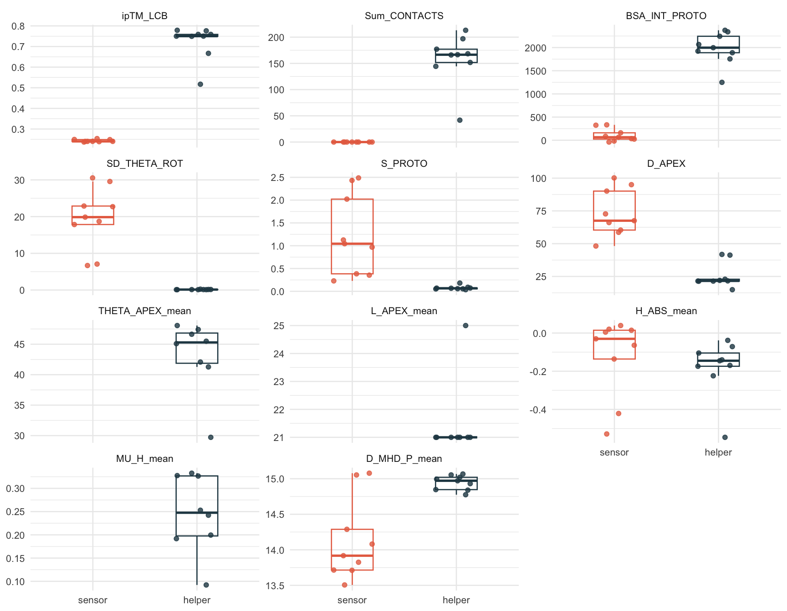
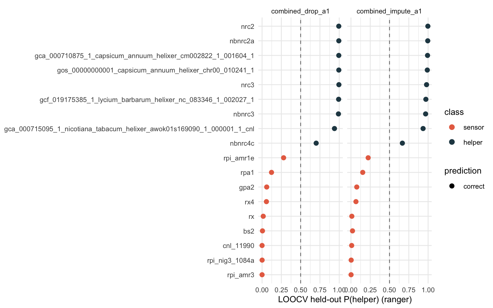
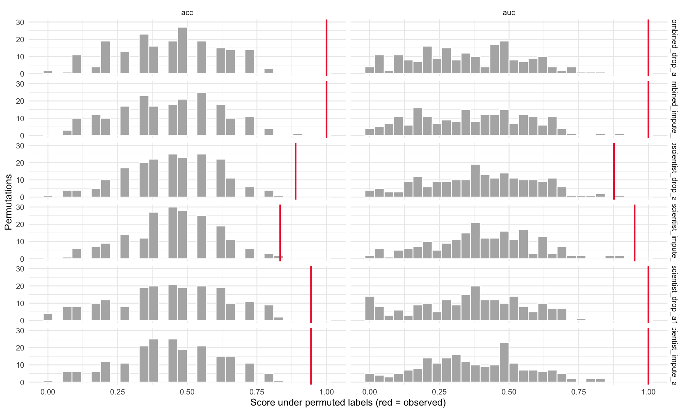
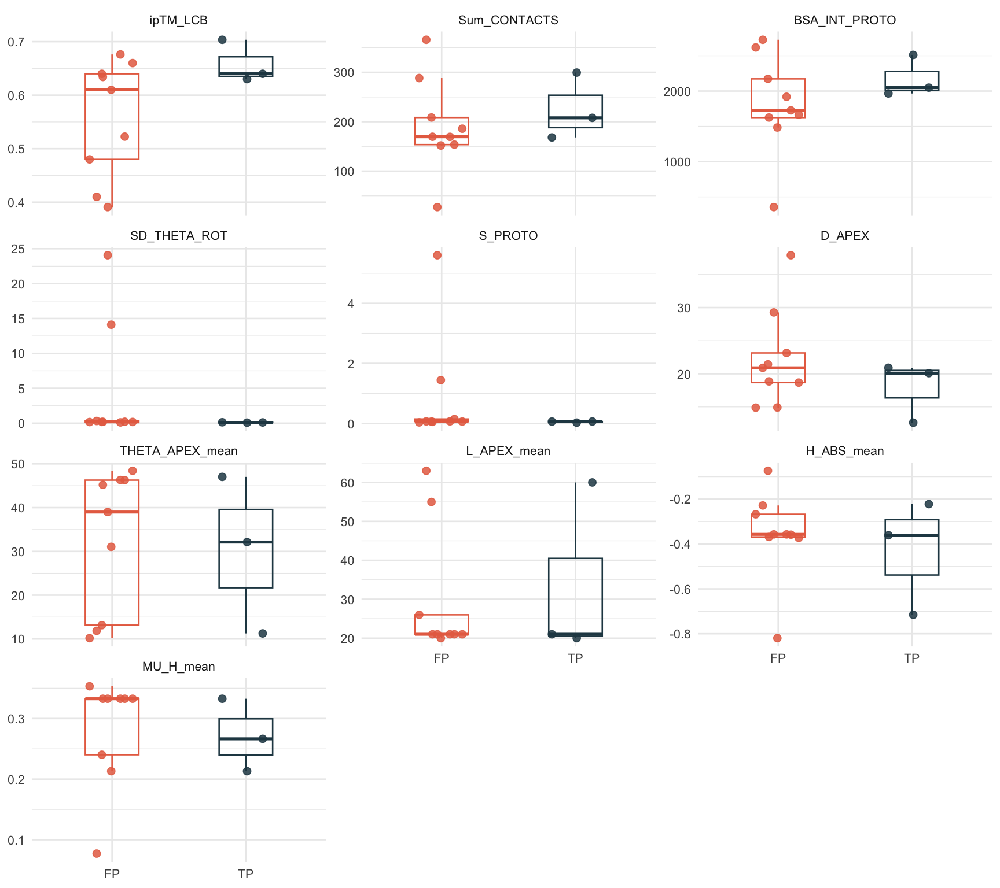
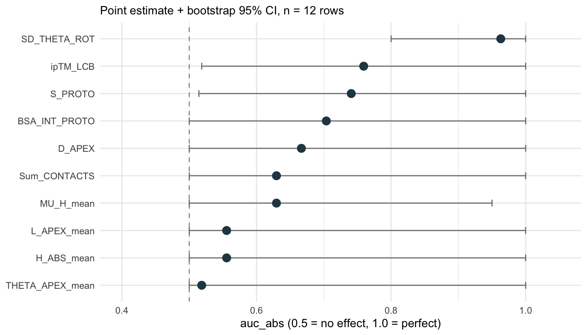
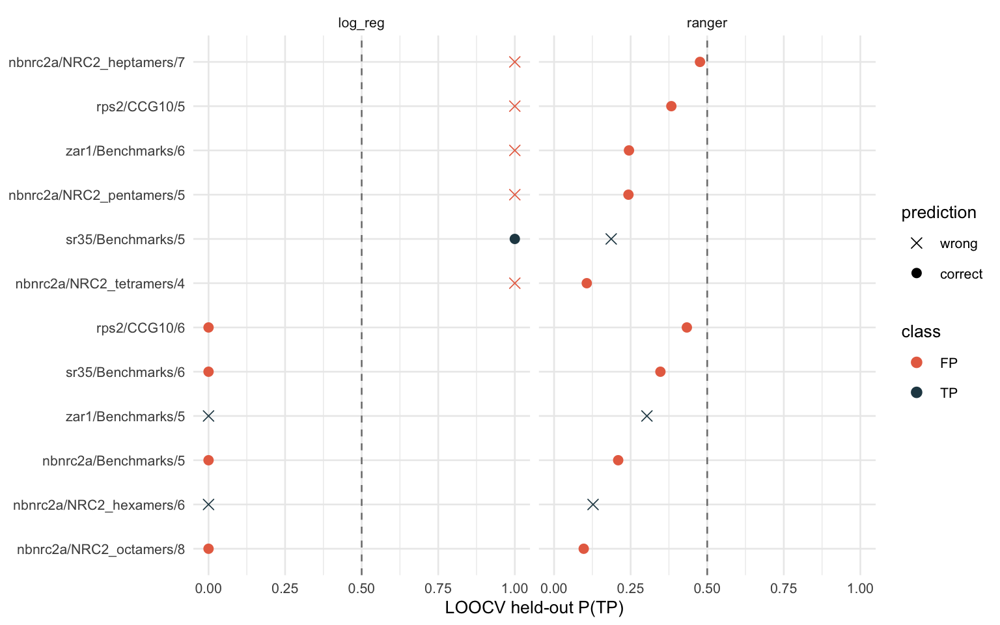
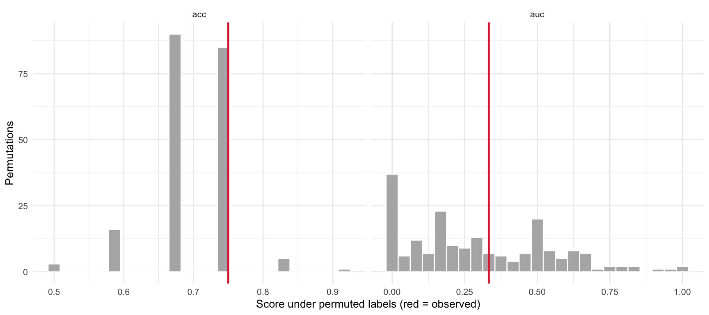
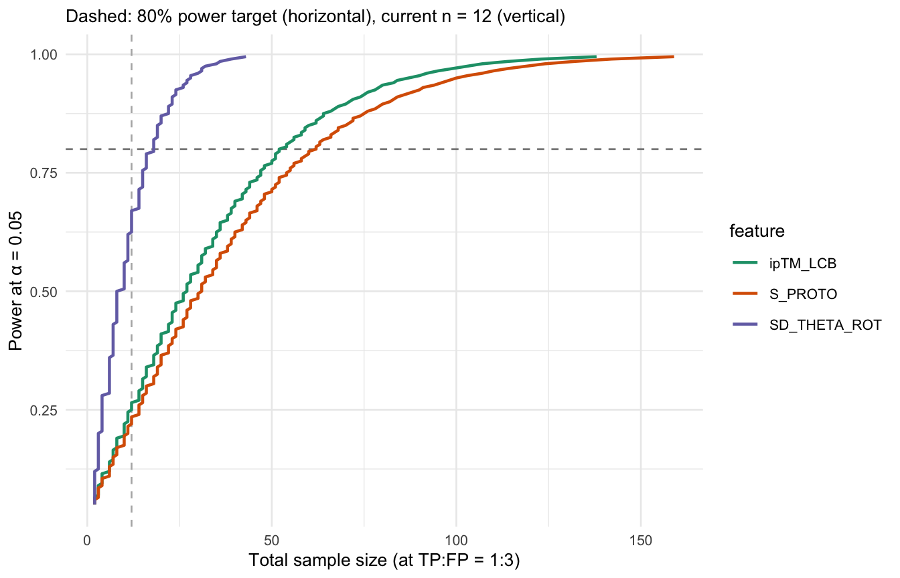

# Can SNI features tell us when an AlphaFold-3 oligomer call is right?
Dan MacLean
2026-04-24

## Abstract

AlphaFold-3 (AF3) produces oligomeric-state predictions for plant NLR
immune receptors. Some of these predictions match the experimentally
determined activated oligomer, others do not. This project asked whether
Structural Neighbourhood Index (SNI) features, computed from AF3 models
by the `resistosome_pipeline`, can flag correct from incorrect
oligomeric calls. On a related benchmark — distinguishing helper and
sensor proteins within the NRC family — the same features work very
well. On the prediction-vs-experiment task, with a 12-row ground-truth
panel drawn from four plant NLRs, they do not: a univariate ranker is
uncertain for almost every feature, a cross-validated classifier does
not beat a majority-class baseline, and the single feature that appears
strong is traceable to a within-protein stoichiometry artefact. A
Wilcoxon–Mann–Whitney power analysis quantifies the gap: the realistic
middle-band features would need on the order of 40–130 independent
ground-truth proteins to detect at 80% power. The constraint is the size
of the curated ground-truth panel, not the choice of classifier.

## Background

The activated oligomeric state of a plant NLR (five, six, or eight
protomers depending on the protein) is the structural signature of its
signalling-competent form. Contreras *et al.* (2024) released a large
set of AF3 predictions of plant-NLR activated states, paired with
`resistosome_pipeline`-computed SNI features for each model. SNI
features are geometric descriptors of the predicted assembly:
per-protomer contacts, buried surface area, apical-rotation statistics,
the ipTM confidence score, and so on.

Two classification questions can be asked of this feature set:

1.  **Helper vs sensor within the NRC family.** A benchmark-style task
    where class membership is known from the literature and the feature
    matrix contains 18 labelled proteins (9 helpers, 9 sensors). This is
    a within-family task used to check that the features carry class
    information under a standard supervised setup.
2.  **AF3 prediction correct vs incorrect.** The task this project is
    actually about: is the AF3-predicted oligomer the same as the
    experimentally determined activated oligomer (TP) or not (FP)?
    Ground truth here is the experimental oligomer published for each of
    a small set of plant NLRs.

The two tasks share the SNI feature set but are biologically different.
The first measures within-family discrimination; the second measures
whether SNI features can catch AF3 mistakes.

## The helper/sensor task: features carry real signal

On the NRC helper/sensor benchmark, the univariate view (notebook 001)
shows that several of the eleven canonical SNI features separate the two
classes cleanly — six of them reach a rank-AUC of 1.0, meaning every
helper value is above every sensor value (or vice versa) on that
feature.

<div id="fig-001-dist">



Figure 1: Per-feature distributions on the helper/sensor benchmark (n =
18). Each panel shows one of the eleven canonical SNI features; points
are individual proteins, coloured by class. Several features separate
helpers from sensors without overlap. Source: notebook 001, chunk
`dist-11`.

</div>

A multivariate leave-one-out cross-validation (LOOCV) classifier
(notebook 002) confirms that the univariate signal carries through.
Under LOOCV, each protein is held out in turn, the classifier is trained
on the remaining seventeen, and the prediction on the held-out protein
is recorded. The held-out probabilities cluster cleanly on the correct
side of the 0.5 decision line for nearly all proteins.

<div id="fig-002-heldout">



Figure 2: Held-out P(helper) per protein under LOOCV, combined feature
subset. Each point is one protein’s probability of being a helper when
it was the held-out sample; colour marks the true class. Points to the
right of the dashed 0.5 line are classified as helper. Source: notebook
002, chunk `held-out-plot`.

</div>

To rule out the small sample size (n = 18) producing an accidentally
good score, the same pipeline is re-run many times on label-shuffled
copies of the data. The observed accuracy and AUC sit well above the
permutation null, so the signal is not an artefact of labelling luck.

<div id="fig-002-permute">



Figure 3: Permutation null distribution for LOOCV accuracy and AUC on
the helper/sensor task. Histograms are scores from the same pipeline run
on label-shuffled data; vertical lines are the observed scores on the
real labels. The observed values lie far in the upper tail of the null.
Source: notebook 002, chunk `permute-plot`.

</div>

Put plainly: the SNI features, as a set, do encode information that
separates NRC helpers from sensors in a way a standard classifier can
exploit. That is the positive control for what follows.

## The prediction-vs-experiment task and the ground-truth panel

Notebooks 003 and 004 assembled the ground-truth panel. The panel pairs
AF3 oligomer predictions from Contreras *et al.* with literature-sourced
experimental oligomers for plant NLRs whose activated state has been
resolved. After a deduplication rule that drops same-model repeats
across the `AF_benchmark` and `Benchmarks` archives, the resulting
matrix has 12 labelled rows drawn from four distinct proteins.

| Protein | Rows |  TP |  FP |
|:--------|-----:|----:|----:|
| nbnrc2a |    6 |   1 |   5 |
| rps2    |    2 |   0 |   2 |
| sr35    |    2 |   1 |   1 |
| zar1    |    2 |   1 |   1 |

Table 1. Ground-truth panel after dedup: 12 rows, 4 proteins, 3 TP and 9
FP.

The panel’s awkward features for learning are visible in the table:
`NbNRC2a` dominates the row count (six rows, of which only one is a TP),
`Sr35` and `ZAR1` contribute two rows each, and `RPS2` contributes two
rows both of which are FP (its true activated state is an octamer, so
neither of the deposited penta-/hexa- predictions is correct). The
overall class ratio is 1 TP : 3 FP, and only three of the four proteins
contribute any TP row at all.

## Per-feature signal on the TP/FP task is weak and uncertain

The same univariate view as in
<a href="#fig-001-dist" class="quarto-xref">Figure 1</a>, but on the
12-row panel and with TP vs FP as the class label, produces a very
different picture. Within-class spread is large relative to the gap
between classes, and for most features the distributions overlap
substantially.

<div id="fig-005-dist">



Figure 4: Per-feature distributions on the TP/FP panel (n = 12). Same
plot type as <a href="#fig-001-dist" class="quarto-xref">Figure 1</a>.
Unlike the helper/sensor case, most features show substantial overlap
between TP and FP rows. Source: notebook 005, chunk `dist-10`.

</div>

Quantifying signal and uncertainty per feature (notebook 007 §1) makes
the picture explicit. For each feature the plot shows the rank-AUC point
estimate (treating the feature as a one-dimensional ranker of TP vs FP,
with AUC reflected to lie in \[0.5, 1\]) and a bootstrap 95% confidence
interval obtained by resampling the 12 rows with replacement.

<div id="fig-007-auc">



Figure 5: Per-feature rank-AUC with bootstrap 95% CI on the TP/FP panel.
AUC = 0.5 is the dashed line (no effect). Almost every feature’s CI
overlaps or touches 0.5. Source: notebook 007, chunk `auc-ci-plot`.

</div>

Only `SD_THETA_ROT` — the per-protomer standard deviation of apical
rotation angle — has a CI that clearly excludes 0.5, and even its CI
reaches 1.0. Every other feature’s CI is consistent with “no real signal
at n = 12”. A sample size of twelve, split 3 TP : 9 FP, is not enough to
pin down per-feature effect sizes.

## A classifier does not beat the majority-class baseline

If individual features don’t give a clean ranking, perhaps a
multivariate classifier will. Notebook 005 fits the same mlr3 pipeline
used in 002, under LOOCV, on the TP/FP panel. The held-out probabilities
show no clean separation between TP and FP rows, and the aggregate LOOCV
accuracy is 9/12 — exactly the score a trivial “always predict FP”
learner gets, because FP is the majority class in every training fold.

<div id="fig-005-heldout">



Figure 6: Held-out P(TP) per row under LOOCV on the TP/FP panel. TP and
FP rows are interleaved across the 0.5 decision line. Source: notebook
005, chunk `held-out`.

</div>

A permutation null constructed the same way as in
<a href="#fig-002-permute" class="quarto-xref">Figure 3</a> confirms the
reading: the observed LOOCV score sits inside the shuffled-label null
distribution, not in the tail.

<div id="fig-005-permute">



Figure 7: Permutation null for LOOCV accuracy and AUC on the TP/FP
panel. The observed value lies inside the null distribution, unlike the
helper/sensor contrast in
<a href="#fig-002-permute" class="quarto-xref">Figure 3</a>. Source:
notebook 005, chunk `permute-plot`.

</div>

The one feature with a point-estimate AUC above 0.9 — `SD_THETA_ROT` —
deserves a second look, because an AUC of 0.96 sounds like a usable
signal. Notebook 006 tests whether it transfers across proteins by
switching from leave-one-row-out to leave-one-protein-out (LOPO): the
classifier is trained on three proteins at a time and predicts on the
fourth. Under LOPO the classifier collapses to the training-majority
class in every fold, and the pooled held-out AUC drops to ~0.31. The
apparent strength of `SD_THETA_ROT` in the LOOCV setting is driven by
the six NbNRC2a rows (one correct hexamer contrasted against five
forced-wrong stoichiometries of *the same protein*). Reading across
proteins, the signal is not there.

## How many more ground-truth proteins would be needed?

Given effect sizes this uncertain, the defensible next question is
quantitative: how many rows, and how many proteins, would be required
for a univariate Wilcoxon–Mann–Whitney test to detect each feature’s
observed signal at the conventional 80% power? The `WMWssp` package
implements Noether’s (1987) sample-size formula for the WMW statistic;
applying it at α = 0.05, power = 0.8, and the observed 1 TP : 3 FP ratio
(notebook 007 §2–§3) gives the curves below for the top three features.

<div id="fig-007-power">



Figure 8: Power curves for the three strongest features at α = 0.05 and
the observed 1:3 class ratio. Horizontal dashed line = 80% power target;
vertical dashed line = current n = 12. Points on each curve are
`WMWssp_noether` outputs for a sweep of target power levels. Source:
notebook 007, chunk `power-curves`.

</div>

Three bands emerge once the full feature set is tabulated:

- `SD_THETA_ROT` (AUC ≈ 0.96) crosses 80% power at ~18 rows. The
  arithmetic says we already have enough, but notebook 006 showed that
  signal is pseudo-replicated across NbNRC2a’s stoichiometry sweep.
  Acting on it would mean curating more NbNRC2a, which doesn’t address
  the across-protein question.
- The middle band — `ipTM_LCB`, `S_PROTO`, `BSA_INT_PROTO`, `D_APEX`
  (AUC ≈ 0.67–0.76) — crosses 80% power at roughly 50–130 total rows. At
  the rule-of-thumb conversion of one informative row per newly curated
  protein, this is on the order of **40–130 additional independent
  ground-truth proteins** on top of the four already in the panel.
- The weakest features (AUC ≈ 0.52–0.63) need hundreds to thousands of
  rows to detect, which isn’t a realistic curation target for plant
  NLRs.

Two caveats on these numbers. First, they are conditional on the
observed AUC point estimates; with n = 12 those estimates are themselves
uncertain (<a href="#fig-007-auc" class="quarto-xref">Figure 5</a>), so
the sample-size numbers should be read as order-of-magnitude guides
rather than exact targets. Second, a univariate Wilcoxon power is a
lower bar than a multivariate classifier would clear at the same n; if
the single-feature test needs tens of proteins, a multivariate
classifier on the same features will not be usefully easier to power.

## Conclusion

On a related within-NRC task the SNI feature set carries enough
information for a standard classifier to separate helpers from sensors
(<a href="#fig-002-heldout" class="quarto-xref">Figure 2</a>,
<a href="#fig-002-permute" class="quarto-xref">Figure 3</a>). On the
prediction-vs-experiment task, with the current 12-row panel from four
proteins, the same feature set does not support a classifier that beats
a majority-class baseline
(<a href="#fig-005-heldout" class="quarto-xref">Figure 6</a>,
<a href="#fig-005-permute" class="quarto-xref">Figure 7</a>),
per-feature effect sizes are too uncertain to pin down
(<a href="#fig-007-auc" class="quarto-xref">Figure 5</a>), and the one
feature that appears strong is a within-protein artefact. The binding
constraint is the size of the ground-truth panel, not the choice of
feature set or classifier.

A targeted curation effort that adds plant NLRs with
experimentally-resolved activated oligomeric state — on the order of
tens of additional independent proteins — is what would move the
middle-band features into the range where a test could detect them. That
is the pragmatic next step this analysis supports.

## Notebook pointers

- **001** — EDA of the 18-protein helper/sensor benchmark matrix.
- **002** — mlr3 LOOCV baseline and permutation null on 001’s matrix.
- **003** — ground-truth curation: literature sources and audit trail.
- **004** — feature-matrix build, QC, dedup rule, and the join with AF3
  predictions.
- **005** — EDA and baseline classifier on the 12-row TP/FP panel.
- **006** — leave-one-protein-out cross-validation (curiosity pass).
- **007** — power analysis using `WMWssp` (Noether 1987).

## Reproducing the analysis

The committed tree includes the curated inputs and the
`resistosome_pipeline` outputs under `results/004_full_run/`, so the
notebooks render end-to-end without needing to refetch or rerun the AF3
feature pipeline.

**R environment.** Package versions are pinned via `renv`:

``` r
# from the sni_ml/ directory
renv::restore()
```

**Sibling dependency.** Notebooks 001–004 and
`data/contreras_af3/run_pipeline_all.sh` expect the `SolNRCH_foldome`
repository cloned as a sibling of `sni_ml`:

    sni_paper/
    ├── sni_ml/                 # this repository
    └── SolNRCH_foldome/        # cloned separately; see its own README

This is the project that defines the canonical 11 SNI features and ships
the `resistosome_pipeline`. We do not vendor it here.

**Rendering.** All documents are Quarto:

``` sh
quarto render README.qmd
quarto render notebooks/   # or any single notebook
```

**Rebuilding from raw AF3 archives (optional).** The 13 GB of Contreras
*et al.* Zenodo archives and the 185 MB staged tree are not tracked;
they are regenerated by:

``` sh
cd data/contreras_af3
./fetch.sh        # resumable curl from Zenodo 11546022
python stage.py   # unpack zips into staging/
./run_pipeline_all.sh   # runs SolNRCH_foldome/resistosome_pipeline
```

This is only needed if you want to reproduce the contents of
`results/004_full_run/` from scratch.
